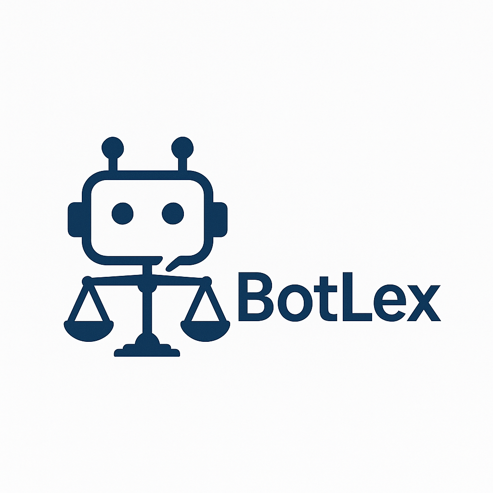

# 🤖 BotLex — Offline & Trainable 

BotLex est un **bot intelligent, personnalisable et hors-ligne** développé en Python. Conçu pour offrir une interaction fluide, il peut être **entraîné** avec vos propres données, sans dépendre d’aucune API externe ni connexion Internet. Idéal pour les environnements sécurisés ou déconnectés.

##  Fonctionnalités

-  **Mode Hors-Ligne** : Pas besoin d’Internet pour fonctionner.
-  **Entraînable** : Adaptez les réponses du bot à vos besoins spécifiques.
-  **Rapide et Léger** : Aucun serveur requis, parfait pour les systèmes embarqués ou les projets locaux.
-  **Modulaire** : Code structuré pour une personnalisation facile.
-  **Sécurisé** : Aucune communication avec des services externes.

